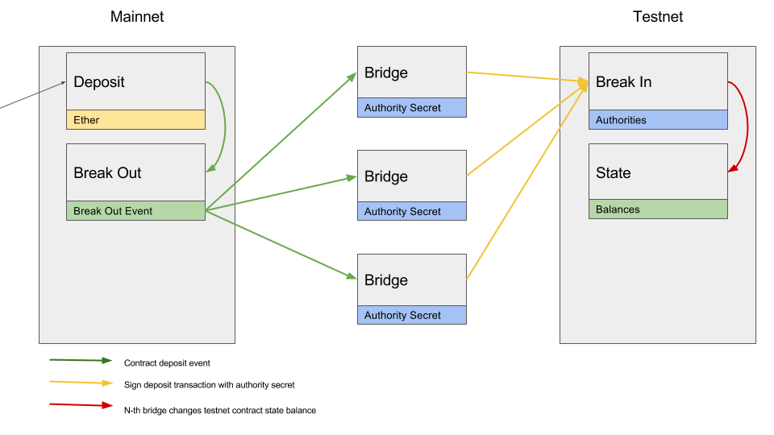
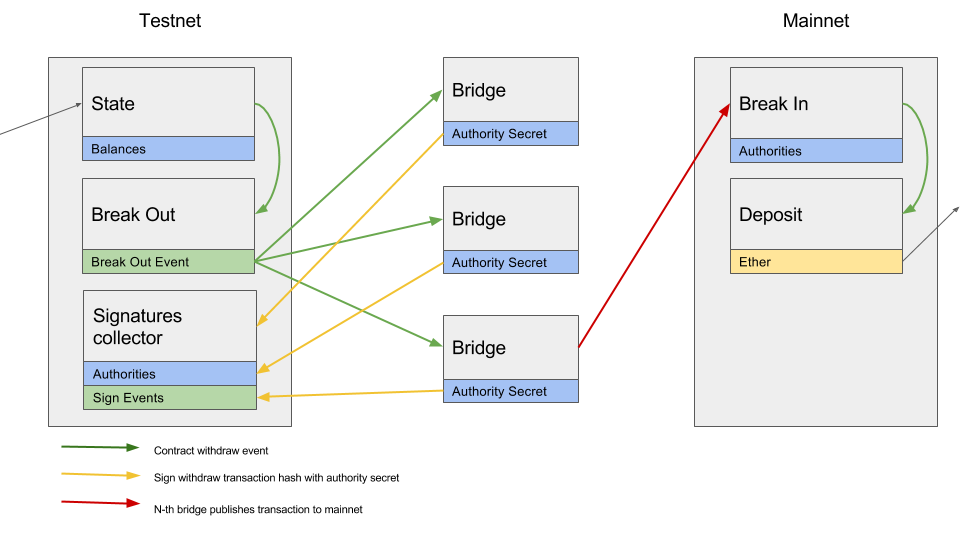

# bridge

[![Build Status][travis-image]][travis-url]
[![Solidity Coverage Status][coveralls-image]][coveralls-url] (contracts only)

[travis-image]: https://travis-ci.org/paritytech/parity-bridge.svg?branch=master
[travis-url]: https://travis-ci.org/paritytech/parity-bridge
[coveralls-image]: https://coveralls.io/repos/github/paritytech/parity-bridge/badge.svg?branch=master
[coveralls-url]: https://coveralls.io/github/paritytech/parity-bridge?branch=master

the bridge is an
[ERC20 token](https://github.com/ethereum/EIPs/blob/master/EIPS/eip-20.md)
contract on one ethereum-based blockchain that is backed by ether on **another** ethereum-based blockchain.

users can convert ether
on one chain into the same amount of ERC20 tokens on the other and back.
the bridge securely relays these conversions.

**the bridge can mitigate scaling issues:**
by deploying a [proof-of-authority](https://paritytech.github.io/wiki/Proof-of-Authority-Chains.html)
network and bridging it to the Ethereum Foundation network ('mainnet') users can convert their mainnet ether
into ERC20 tokens on the PoA chain
and there transfer them with much lower transaction fees,
faster block times and unaffected by mainnet congestion.

the users can withdraw their tokens worth of ether on the mainnet at any point.

parity is using the bridge project to prototype
the system that will eventually connect ethereum and other non-parachains to
[polkadot](https://polkadot.io/).

### next steps

1. deploy to bridge **ethereum** and **kovan** with the kovan authorities being the fixed set of bridge authorities
2. make the bridge work with contract-based dynamic validator sets
3. after kovan hardfork 2: deploy to kovan again with dynamic validator set

### current functionality

the bridge connects two chains `home` and `foreign`.

when users deposit ether into the `HomeBridge` contract on `home`
they get the same amount of ERC20 tokens on `foreign`.

[they can use `ForeignBridge` as they would use any ERC20 token.](https://github.com/ethereum/EIPs/blob/master/EIPS/eip-20.md)

to convert their `foreign` ERC20 into ether on `home`
users can always call `ForeignBridge.transferHomeViaRelay(homeRecipientAddress, value)`.

`foreign` is assumed to use PoA (proof of authority) consensus.
relays between the chains happen in a byzantine fault tolerant way using the authorities of `foreign`.

### highlevel explanation of home ether -> foreign ERC20 relay

`sender` deposits `value` into `HomeBridge`.
the `HomeBridge` fallback function emits `Deposit(sender, value)`.

for each `Deposit` event on `HomeBridge` every authority executes
`ForeignBridge.deposit(sender, value, transactionHash)`.

once there are `ForeignBridge.requiredSignatures` such transactions
with identical arguments and from distinct authorities then
`ForeignBridge.balanceOf(sender)` is increased by `value`.

### highlevel explanation of foreign ERC20 -> home ether relay

`sender` executes `ForeignBridge.transferHomeViaRelay(recipient, value)`
which checks and reduces `ForeignBridge.balances(sender)` by `value` and emits `ForeignBridge.Withdraw(recipient, value)`.

for each `ForeignBridge.Withdraw` every bridge authority creates a message containg
`value`, `recipient` and the `transactionHash` of the transaction containing the `ForeignBridge.Withdraw` event,
signs the message and executes `ForeignBridge.submitSignature(signature, message)`.
this collection of signatures on `foreign` is necessary because transactions are free
for authorities on `foreign`, since they are the authorities of `foreign`, but not free on `home`.

once `ForeignBridge.requiredSignatures` signatures by distinct authorities are collected
a `ForeignBridge.CollectedSignatures(authorityThatSubmittedLastSignature, messageHash)` event is emitted.

everyone (usually `authorityThatSubmittedLastSignature`) can then call `ForeignBridge.message(messageHash)` and
`ForeignBridge.signature(messageHash, 0..requiredSignatures)`
to look up the message and signatures and execute `HomeBridge.withdraw(vs, rs, ss, message)`
and complete the withdraw.

`HomeBridge.withdraw(vs, rs, ss, message)` recovers the addresses from the signatures,
checks that enough authorities in its authority list have signed and
finally transfers `value` ether ([minus the relay gas costs](#recipient-pays-relay-cost-to-relaying-authority))
to `recipient`.

### run truffle smart contract tests

requires `yarn` to be `$PATH`. [installation instructions](https://yarnpkg.com/lang/en/docs/install/)

```
cd truffle
yarn test
```

### build

requires `rust` and `cargo`: [installation instructions.](https://www.rust-lang.org/en-US/install.html)

requires `solc` to be in `$PATH`: [installation instructions.](https://solidity.readthedocs.io/en/develop/installing-solidity.html)

assuming you've cloned the bridge (`git clone git@github.com:paritytech/parity-bridge.git`)
and are in the project directory (`cd parity-bridge`) run:

```
cargo build -p bridge-cli --release
```

to install copy `../target/release/bridge` into a folder that's in your `$PATH`.

### run

```
bridge --config config.toml --database db.toml
```

- `--config` - location of the configuration file. configuration file must exist
- `--database` - location of the database file.
  if there is no file at specified location, new bridge contracts will be deployed
  and new database will be created

### configuration [file example](./examples/config.toml)

```toml
estimated_gas_cost_of_withdraw = 100000

[home]
account = "0x006e27b6a72e1f34c626762f3c4761547aff1421"
ipc = "/Users/marek/Library/Application Support/io.parity.ethereum/jsonrpc.ipc"
required_confirmations = 0

[home.contract]
bin = "contracts/EthereumBridge.bin"

[foreign]
account = "0x006e27b6a72e1f34c626762f3c4761547aff1421"
ipc = "/Users/marek/Library/Application Support/io.parity.ethereum/jsonrpc.ipc"
required_confirmations = 0

[foreign.contract]
bin = "contracts/KovanBridge.bin"

[authorities]
accounts = [
	"0x006e27b6a72e1f34c626762f3c4761547aff1421",
	"0x006e27b6a72e1f34c626762f3c4761547aff1421",
	"0x006e27b6a72e1f34c626762f3c4761547aff1421"
]
required_signatures = 2

[transactions]
home_deploy = { gas = 500000 }
foreign_deploy = { gas = 500000 }
```

#### options

- `estimated_gas_cost_of_withdraw` - how much gas a transaction to `HomeBridge.withdraw` consumes (**required**)
  - currently recommended value: `100000`
  - run [tools/estimate_gas_costs.sh](tools/estimate_gas_costs.sh) to compute an estimate
  - see [recipient pays relay cost to relaying authority](#recipient-pays-relay-cost-to-relaying-authority) for why this config option is needed

#### home options

- `home.account` - authority address on the home (**required**)
- `home.ipc` - path to home parity ipc handle (**required**)
- `home.contract.bin` - path to the compiled bridge contract (**required**)
- `home.required_confirmations` - number of confirmation required to consider transaction final on home (default: **12**)
- `home.poll_interval` - specify how often home node should be polled for changes (in seconds, default: **1**)
- `home.request_timeout` - specify request timeout (in seconds, default: **5**)

#### foreign options

- `foreign.account` - authority address on the foreign (**required**)
- `foreign.ipc` - path to foreign parity ipc handle (**required**)
- `foreign.contract.bin` - path to the compiled bridge contract (**required**)
- `foreign.required_confirmations` - number of confirmation required to consider transaction final on foreign (default: **12**)
- `foreign.poll_interval` - specify how often home node should be polled for changes (in seconds, default: **1**)
- `foreign.request_timeout` - specify request timeout (in seconds, default: **5**)


#### authorities options

- `authorities.account` - all authorities (**required**)
- `authorities.required_signatures` - number of authorities signatures required to consider action final (**required**)

#### transaction options

- `transaction.home_deploy.gas` - specify how much gas should be consumed by home contract deploy
- `transaction.home_deploy.gas_price` - specify gas price for home contract deploy
- `transaction.foreign_deploy.gas` - specify how much gas should be consumed by foreign contract deploy
- `transaction.foreign_deploy.gas_price` - specify gas price for foreign contract deploy
- `transaction.deposit_relay.gas` - specify how much gas should be consumed by deposit relay
- `transaction.deposit_relay.gas_price` - specify gas price for deposit relay
- `transaction.withdraw_confirm.gas` - specify how much gas should be consumed by withdraw confirm
- `transaction.withdraw_confirm.gas_price` - specify gas price for withdraw confirm
- `transaction.withdraw_relay.gas` - specify how much gas should be consumed by withdraw relay
- `transaction.withdraw_relay.gas_price` - specify gas price for withdraw relay

### database file format

```toml
home_contract_address = "0x49edf201c1e139282643d5e7c6fb0c7219ad1db7"
foreign_contract_address = "0x49edf201c1e139282643d5e7c6fb0c7219ad1db8"
home_deploy = 100
foreign_deploy = 101
checked_deposit_relay = 120
checked_withdraw_relay = 121
checked_withdraw_confirm = 121
```

**all fields are required**

- `home_contract_address` - address of the bridge contract on home chain
- `foreign_contract_address` - address of the bridge contract on foreign chain
- `home_deploy` - block number at which home contract has been deployed
- `foreign_deploy` - block number at which foreign contract has been deployed
- `checked_deposit_relay` - number of the last block for which an authority has relayed deposits to the foreign
- `checked_withdraw_relay` - number of the last block for which an authority has relayed withdraws to the home
- `checked_withdraw_confirm` - number of the last block for which an authirty has confirmed withdraw

### example run

```
./target/release/bridge --config examples/config.toml --database db.toml
```

- example run requires a parity instance running
- this parity instance can be started by running `examples/parity_start.sh`
- it connects to this parity instance twice. one connection treats the node as `home`, whereas the other as `foreign`
- by default, parity tries to unlock account generates from seedphrase `this is sparta` - `0x006e27b6a72e1f34c626762f3c4761547aff1421`
- this is just an example. the 'real world' bridge needs to connect to the two different parity instances

### deposit



### withdraw



### recipient pays relay cost to relaying authority

a bridge `authority` has to pay for gas (`cost`) to execute `HomeBridge.withdraw` when
withdrawing `value` from `foreign` chain to `home` chain.
`value - cost` is transferred to the `recipient`. `cost` is transferred to the `authority`
executing `HomeBridge.withdraw`.
the `recipient` pays the relaying `authority` for the execution of the transaction.
that shuts down an attack that enabled exhaustion of authorities funds on `home`.

read on for a more thorough explanation.

parity-bridge connects a value-bearing ethereum blockchain `home`
(initally the ethereum foundation chain)
to a non-value-bearing PoA ethereum blockchain `foreign` (initally the kovan testnet).

value-bearing means that the ether on that chain has usable value in the sense that
in order to obtain it one has to either mine it (trade in electricity)
or trade in another currency.
non-value-bearing means that one can easily obtain a large amount of ether
on that chain for free.
through a faucet in the case of testnets for example.

the bridge authorities are also the validators of the `foreign` PoA chain.
transactions by the authorities are therefore free (gas price = 0) on `foreign`.

to execute a transaction on `home` a bridge authority has to spend ether to
pay for the gas.

this opened up an attack where a malicious user could
deposit a very small amount of wei on `HomeBridge`, get it relayed to `ForeignBridge`,
then spam `ForeignBridge.transfer` with `1` wei withdraws.
it would cost the attacker very little `home` chain wei and essentially
free `foreign` testnet wei to cause the authorities to spend orders of magnitude more wei
to relay the withdraw to `home` by executing `HomeBridge.withdraw`.
an attacker was able to exhaust bridge authorities funds on `home`.

to shut down this attack `HomeBridge.withdraw` was modified so
`value - cost` is transferred to the `recipient` and `cost` is transferred to the `authority`
doing the relay.
this way the `recipient` pays the relaying `authority` for the execution of the `withdraw` transaction.

if the value withdrawn is too low to pay for the relay at current gas prices then
bridge authorities will ignore it. one can think of it as value getting
spent entirely on paying the relay with no value left to pay out the recipient.

`HomeBridge.withdraw` is currently the only transaction bridge authorities execute on `home`.
care must be taken to secure future functions that bridge authorities will execute
on `home` in similar ways.
